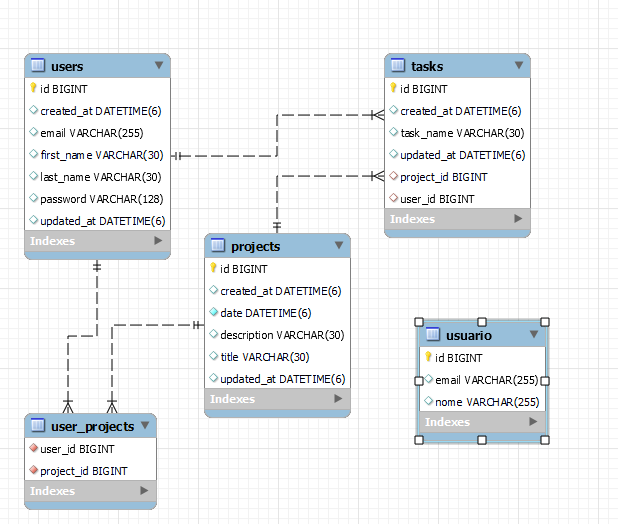

# Gerenciador de projetos

# Descrição 

O projeto que criei é uma API em Java para ajudar os desenvolvedores na gestão de seus projetos. Com esta API, os desenvolvedores podem criar novos projetos, adicionar tarefas e atribuir tarefas aos membros da equipe.

A API é fácil de usar e possui documentação clara para ajudar os desenvolvedores a se familiarizarem com ela. Ela também inclui recursos avançados, como acompanhamento de progresso e alertas de prazo, para garantir que os projetos sejam concluídos dentro do prazo e do orçamento.

A API foi desenvolvida com base em melhores práticas de desenvolvimento de software e usa tecnologias de ponta para garantir alta performance e escalabilidade. Também inclui recursos de segurança robustos para proteger os dados dos usuários e impedir violações de segurança.

Os desenvolvedores podem integrar facilmente a API em seus próprios sistemas de gerenciamento de projetos, permitindo que eles se concentrem em desenvolver seus próprios aplicativos e soluções em vez de se preocupar com a gestão de projetos.

Em resumo, a API em Java que criei é uma solução eficaz para ajudar os desenvolvedores na gestão de seus projetos. Com ela, os desenvolvedores podem criar projetos, adicionar tarefas e acompanhar o progresso de seus projetos de forma fácil e eficiente.

# Use Case

## Login no Sistema

Ator primário: Usuário

Pré-condições:

O usuário deve estar registrado no sistema.
O usuário deve ter credenciais de login válidas.

Fluxo principal:

* O usuário acessa a página de login do sistema.
* O sistema exibe uma tela de login com campos para inserir o email do usuário e a senha.
* O usuário insere seu email de usuário e senha e clica no botão "Realizar Login".
* O sistema valida as credenciais do usuário e autentica o usuário no sistema.
* O sistema redireciona o usuário para a página inicial do sistema.

Fluxo alternativo:

* Se o usuário inserir credenciais inválidas, o sistema exibirá uma mensagem de erro e solicitará que o usuário insira as credenciais corretas.

Pós-condições:

* O usuário é autenticado no sistema e pode acessar as funcionalidades disponíveis para seu perfil.

Restrições:

* O sistema deve armazenar as credenciais do usuário de forma segura e proteger contra ataques de hackers ou invasões de segurança.

## Registro de novo usuário

Ator primário: Usuário

Pré-condições:

* O usuário deve estar na página de registro do sistema.
* O usuário deve ter um endereço de e-mail válido.

Fluxo principal:

* O usuário acessa a página de registro do sistema.
* O sistema exibe uma tela de registro com campos para inserir informações pessoais, como nome e sobrenome, endereço de e-mail e senha.
* O usuário insere suas informações pessoais e clica no botão "Registrar".
* O sistema valida as informações do usuário e cria uma nova conta para o usuário.
* O sistema redireciona o usuário para a página inicial do sistema.

Fluxo alternativo:

* Se o usuário inserir informações inválidas, o sistema exibirá uma mensagem de erro e solicitará que o usuário insira as informações corretas.

Pós-condições:

* O usuário tem uma nova conta registrada no sistema e pode acessar as funcionalidades disponíveis para seu perfil.

Restrições:

* O sistema deve armazenar as informações do usuário de forma segura e proteger contra ataques de hackers ou invasões de segurança.

## Criação de novo projeto

Ator primário: Usuário

Pré-condições:

* O usuário deve estar autenticado no sistema.
* O usuário deve ter permissão para criar novos projetos.

Fluxo principal:

* O usuário acessa a página de criação de projetos do sistema.
* O sistema exibe uma tela de criação de projeto com campos para inserir informações sobre o projeto, como nome, descrição e data de conclusão.
* O usuário preenche as informações do projeto e clica no botão "Criar".
* O sistema cria um novo projeto e exibe a página de detalhes do projeto.

Fluxo alternativo:

* Se o usuário não preencher corretamente os campos obrigatórios, o sistema exibirá uma mensagem de erro e solicitará que o usuário insira as informações corretas.

Pós-condições:

* Um novo projeto é criado no sistema e o usuário é redirecionado para a página de detalhes do projeto.

Restrições:

* O sistema deve validar as informações inseridas pelo usuário e garantir que elas sejam coerentes com as regras de negócio do sistema.
* O sistema deve permitir que o usuário edite as informações do projeto posteriormente, caso necessário.
* O sistema deve garantir que apenas usuários com permissão possam criar novos projetos.

## Criação de nova tarefa para projeto

Ator primário: Usuário

Pré-condições:

* O usuário deve estar autenticado no sistema.
* O usuário deve ter permissão para criar novas tarefas.

Fluxo principal:

* O usuário acessa a página de tarefas do projeto desejado.
* O sistema exibe uma tela de tarefas com opção para criar uma nova tarefa.
* O usuário clica no botão "Nova tarefa".
* O sistema exibe uma tela para preencher informações sobre a nova tarefa, crie um título para a tarefa.
* O usuário preenche as informações e clica no botão "Criar".
* O sistema cria uma nova tarefa e adiciona à lista de tarefas do projeto.

Fluxo alternativo:

* Se o usuário não preencher corretamente os campos obrigatórios, o sistema exibirá uma mensagem de erro e solicitará que o usuário insira as informações corretas.

Pós-condições:

* Uma nova tarefa é criada no sistema e adicionada à lista de tarefas do projeto.

Restrições:

* O sistema deve validar as informações inseridas pelo usuário e garantir que elas sejam coerentes com as regras de negócio do sistema.

## Diagrama

